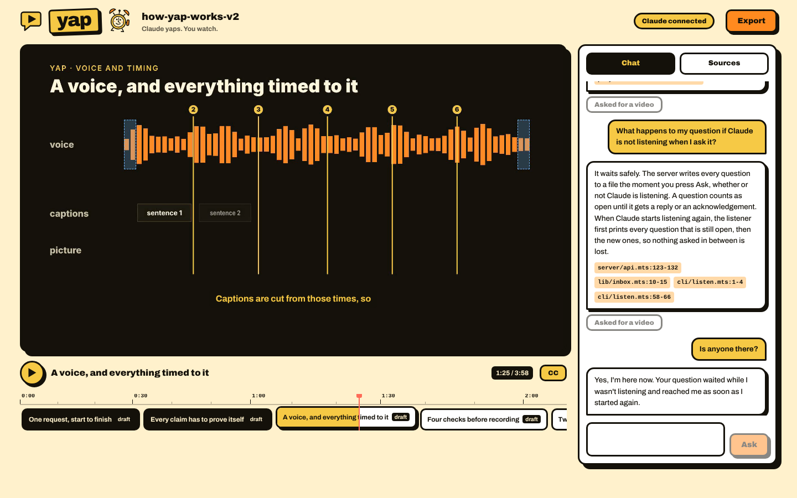

<p align="center">
  
</p>

<h1 align="center">Yap</h1>

<p align="center"><b>Claude yaps. You watch.</b></p>

<p align="center">
  <a href="LICENSE"></a>
  <a href="https://github.com/Aryanshaw/yap/stargazers"></a>
  <a href="https://github.com/Aryanshaw/yap/actions/workflows/player.yml"></a>
  <a href="https://claude.com/claude-code"></a>
  
</p>

Yap is a Claude Code plugin that explains your own codebase as a short narrated video. Ask how a feature works, and
Claude reads the code, writes a script where every claim points at real lines, records a voice-over and renders a
few short chapters. Then it opens them in a player in your browser, where you can keep asking questions.

It is made for people who would rather watch two minutes than read a long plan: someone new to a codebase, a
reviewer checking work Claude did, or anyone stuck on "wait, how does this part actually work?"



## What you get

- **Short chapters, not one long video.** Each chapter covers one step of the flow in 20 to 40 seconds and stands on
  its own, so a new chapter can be added without remaking the rest.
- **Fact-checked against your code.** Every sentence that makes a claim cites a file and line range, and Yap checks
  each quote against the repository before anything is recorded.
- **A player with a chat.** A timeline you can scroll like a video editor, captions, a Sources tab with the code
  each chapter used, and a chat. Questions you type there reach the Claude Code session that made the video. It
  answers in text, with the files it used, and can turn an answer into a new chapter if you ask for one.
- **Everything stays on your machine.** The voice is generated locally, the player runs on `127.0.0.1` with a
  private link, and your repository is only read, never edited. Yap writes only inside a `.yap/` folder.
- **Export.** One click joins the chapters into a single mp4 and saves it with the script and sources.

## Requirements

- macOS or Linux
- [Claude Code](https://claude.com/claude-code)
- Node 22.18 or newer
- ffmpeg that runs (`ffmpeg -version`)
- Python 3.10 to 3.12, or [uv](https://docs.astral.sh/uv/), for the local voice
- At least 1 GB of free disk, plus about 500 MB for the voice
- Memory: Yap renders up to 3 chapters at once, keeping 2 GB free (8 GB of RAM works)

## Install

In a terminal:

```
npx getyap
```

It adds Yap to Claude Code (or updates it), then shows what Yap still needs on this machine, with sizes and the exact
commands, and sets up only what you tick. `npx getyap --yes` sets up everything offered without asking.

Or, from inside Claude Code:

```
/plugin marketplace add Aryanshaw/yap
/plugin install yap@yap
```

Then start a new session and run:

```
/yap doctor
```

The doctor checks everything above. When something is missing, Claude runs `yap setup`, which lists what it can
install for you, with sizes and the exact commands:

| Item | What it installs |
|---|---|
| `voice` | a Python venv in Yap's data folder with `kokoro-onnx` and `soundfile`, and the Kokoro voice model (353 MB) |
| `captions` | optional: whisper.cpp through Homebrew, for word-by-word captions (macOS) |
| `chrome` | the Chrome build Yap renders with |

Nothing is installed until you say which items you want. To update Yap later, run `npx getyap` again, or
`/plugin marketplace update yap` then `/plugin update yap@yap` in Claude Code. Things Yap cannot install for you (ffmpeg, Node, disk
space) are listed with the command to fix them.

## Use

Ask in Claude Code:

```
/yap how does checkout work
/yap explain the job queue as a video
```

Claude narrows the question to one flow, checks the code, makes the chapters (a first chapter usually takes a few
minutes) and gives you a link to the player. In the player:

- **Timeline:** click a chapter to jump to it; a chapter still being made shows as striped.
- **Chat:** ask follow-up questions. Claude answers with the code it used. When an answer is about order, timing or
  how parts work together, it offers **Make this a video**; click it to get a new chapter in the timeline.
- **Sources:** the files and lines behind the chapter you are watching.
- **Export:** save the whole video as one mp4.

The player lives only as long as the Claude Code session that started it. Closing Claude Code stops it.

## How it works

1. **Scope.** Claude picks one flow from your question, and asks at most one clarifying question.
2. **Read and verify.** It reads the code and writes a script in which every claim cites a file and line range.
   `yap audit` checks each quote against the repository; a chapter whose quotes do not match is not made.
3. **Narrate.** The script is spoken locally with Kokoro (through [Hyperframes](https://www.npmjs.com/package/hyperframes)),
   and timed so the visuals and captions follow the voice.
4. **Render.** Each chapter's scene is an HTML page animated with GSAP, rendered to mp4 by Hyperframes. Chapters
   render in parallel, as far as memory allows.
5. **Serve.** `yap serve` starts the local player with a private link.
6. **Chat.** `yap listen` passes the questions typed in the page to the Claude Code session, and `yap reply` sends
   the answers back.

More detail: [docs/ARCHITECTURE.md](docs/ARCHITECTURE.md) for the code layout, the
[design spec](docs/superpowers/specs/2026-10-02-yap-design.md), and a summary per build phase in
[docs/](docs/) (`phase-1` to `phase-4`).

## Status

Yap works end to end, but it is young. See [docs/STATUS.md](docs/STATUS.md) for what has not been checked yet (for
example playback in Safari) and what is planned.

## Development

```
npm ci
npm test                    # type check, then every test in tests/

cd player
npm ci
npm test                    # player unit tests
npm run typecheck
npm run build               # player/dist is committed: rebuild it after player changes
npm run check:dist          # confirms player/dist matches a fresh build
```

Run the CLI straight from the checkout with `node bin/yap.cjs --help`. To try the plugin from your checkout, run
Claude Code with `--plugin-dir /path/to/yap`.

## License

[MIT](LICENSE). `scene-kit/vendor/gsap.min.js` is GSAP, used under its own
[standard license](https://gsap.com/standard-license).
