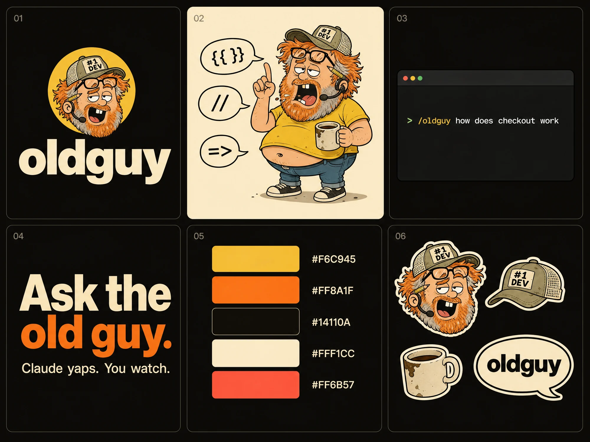
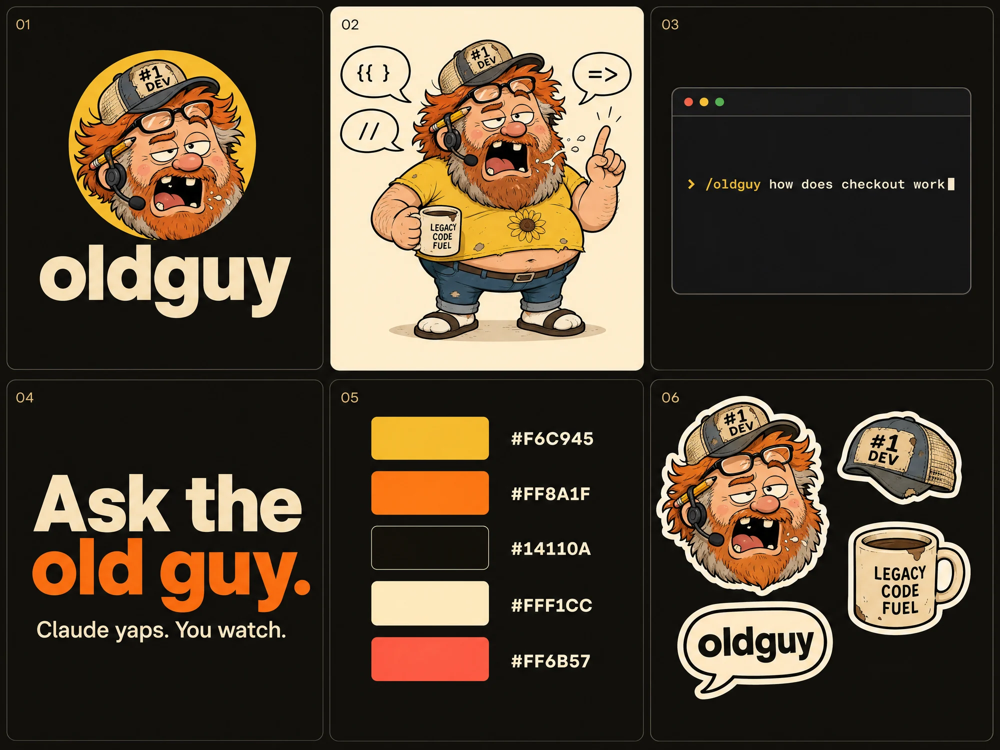
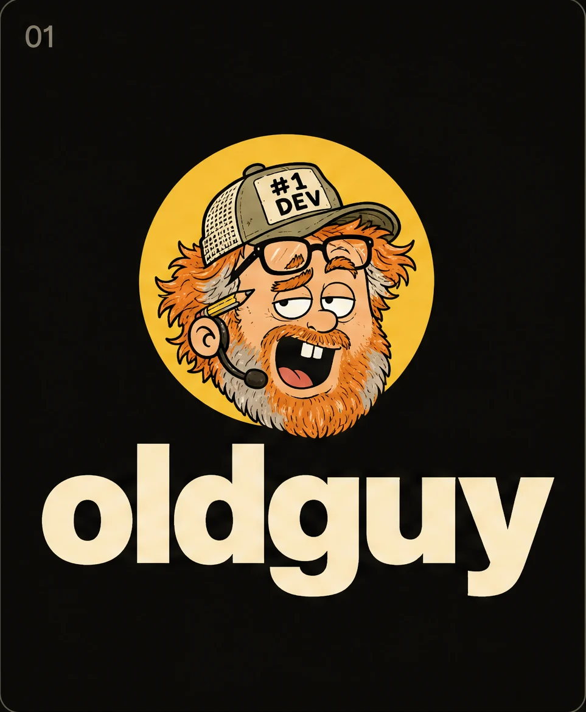
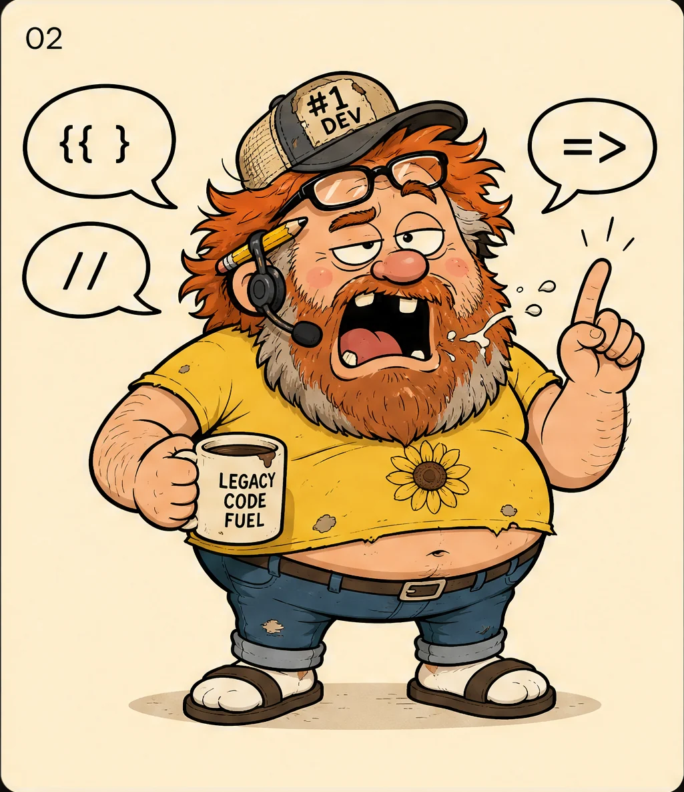
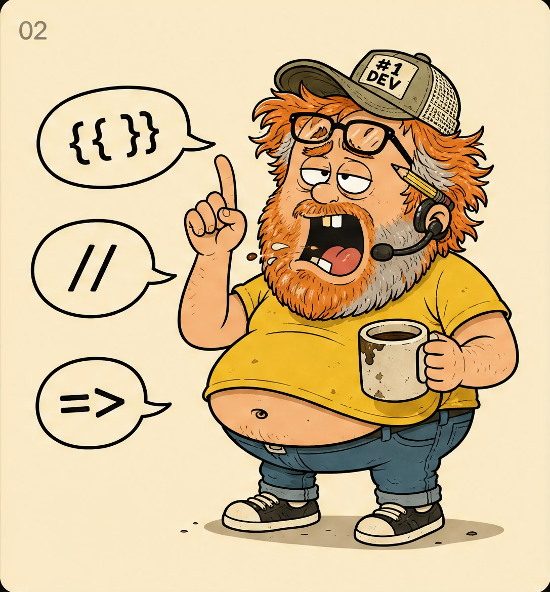

# Rename: Yap → oldguy

Date: 2026-10-07
Status: draft, awaiting approval

## Why

"yap" described the output: a lot of talking. "oldguy" describes an archetype everyone knows: the old guy who
can explain anything to anyone. He's the uncle at the barbecue, or the grandpa who makes a hard thing sound
simple. He has seen enough of everything that he doesn't need to have been there.

The archetype isn't tied to codebases, so it carries across every kind of video the product will make:

- "Ask the old guy how checkout works."
- "Ask the old guy what this paper actually says."
- "Ask the old guy how this API works."

He rambles, but every claim comes with receipts: a file and line, or a page and section. He is approachable for
non-developers too, which a cold AI tool is not.

The name and the mascot now say the same thing. There are no users yet, so this is the cheapest the rename will
ever be.

## Decisions

| Thing | Before | After |
|---|---|---|
| Product name | Yap | oldguy (always lowercase, one word, also at the start of a sentence) |
| Mascot | wind-up alarm clock | "the old guy" (see Branding) |
| Headline | Claude yaps. You watch. | Ask the old guy. |
| Subline | | Claude yaps. You watch. (kept; "yap" survives as the verb) |
| GitHub repo | `Aryanshaw/yap` | `Aryanshaw/oldguy` |
| Marketplace / plugin | `yap` / `yap@yap` | `oldguy` / `oldguy@oldguy` |
| Slash command | `/yap <question>`, `/yap doctor` | `/oldguy <question>`, `/oldguy doctor` |
| Plugin CLI | `bin/yap.cjs`, `yap <cmd>` | `bin/oldguy.cjs`, `oldguy <cmd>` |
| npm installer | `getyap` (`npx getyap`) | `oldguy` (`npx oldguy`); `getyap` deprecated, not migrated |
| Homepage | `https://getyap.dev` | the GitHub repo URL until a domain is bought |
| Project folder | `.yap/` | `.oldguy/` |
| Auth header | `x-yap-key` | `x-oldguy-key` |
| Env var | `YAP_DEV_PORT` | `OLDGUY_DEV_PORT` |
| Temp file prefixes | `yap-*` | `oldguy-*` |
| Scene markers | `data-yap-timeline`, `yapBeats` | `data-oldguy-timeline`, `oldguyBeats` |
| CSS tokens | `--color-yk-*`, `yk-*` classes | `--color-og-*`, `og-*` classes |
| Palette | `#F6C945 #FF8A1F #14110A #FFF1CC #FF6B57` | unchanged |
| Font | Archivo | unchanged |

There are no users, so nothing is kept for compatibility: no `/yap` alias, no reading an old `.yap/` folder, no
`x-yap-key` fallback, no `getyap` shim release.

## Branding

**Character.** The old guy is an original character. He is not based on Crazy Dave or Peter Griffin, and he must
not copy their signature items (no saucepan hat, none of Peter's face or glasses). He is a chubby, dopey,
overconfident veteran:

- a thick messy ginger mop with grey streaks, and a full scruffy ginger-and-grey beard
- half-lidded crossed eyes, one buck tooth, mouth open mid-sentence, finger raised ("well, actually")
- a sun-faded mesh trucker cap with a crooked "#1 DEV" patch, and reading glasses pushed up onto it
- a crooked headset mic, a pencil behind his ear, a too-small yellow t-shirt, and a chipped "LEGACY CODE FUEL" mug

He is long-winded, never senile: jokes are about how much he talks and how long he has been there, never about
his age making him wrong.

**Reference art.** The images below were generated on 2026-10-07 during brainstorming and are stored in
`docs/assets/brand/`. They are the source of truth for how the old guy looks. They are concept images, though, not
art to ship: the SVGs listed further down are redrawn from them.

| File | What it is | Use it for |
|---|---|---|
| `oldguy-concept-board-b.webp` | full brand board, variant B | the chosen layout and the logo cover |
| `oldguy-concept-board-a.webp` | full brand board, variant A | the mug text, the grubbiness, the sticker sheet |
| `oldguy-concept-icon.webp` | variant B, panel 01 | the head-in-yellow-circle mark and the "oldguy" wordmark |
| `oldguy-concept-body-a.webp` | variant A, panel 02 | full body: torn shirt, "LEGACY CODE FUEL" mug, socks with sandals |
| `oldguy-concept-body-b.webp` | variant B, panel 02 | full body, cleaner pose |

The chosen direction is **B's layout and icon, plus A's mug and grubbiness**.

| Mark | Body A | Body B |
|---|---|---|
|  |  |  |

**Known gaps in the concept art.** Fix these in the shipped assets, not by editing the images:

- **Terminal panel.** It is empty on both boards. Marketing material should show the result: chapters with citations
  such as `src/cart/submit.ts:12-40`.
- **Small sizes.** The glasses on the cap and the pencil turn to mush at 32px, which is why there is a separate small
  mark.

**Shipped assets.** Each one is hand-built SVG in the existing palette, with thick `#14110A` outlines and flat fills:

| Asset | Path | Notes |
|---|---|---|
| Mascot, light | `docs/assets/mascot.svg` | bust (head and cap), replaces the clock |
| Mascot, dark | `docs/assets/mascot-dark.svg` | same bust tuned for dark backgrounds, as today |
| Player logo | `player/src/components/Logo.tsx` | mark: the head in a yellow circle; wordmark "oldguy" on the existing tilted yellow chip |
| Small mark | inside `Logo.tsx` (`size="sm"`) and the favicon | reduced head: cap, mop, open mouth only, no glasses or pencil, so it reads at 32px |
| Favicon | `player/index.html` | inline SVG of the small mark |
| Full body | `docs/assets/oldguy-full.svg` | finger-raised pose with the mug, from Body A; used by the README and, later, by templates that feature him as host |

**The character is fixed.** He looks and behaves exactly as on the concept board: dopey, scruffy, blabbering. Do
not make him sharper, wiser or more polished to suit wider use. The joke is that this guy is the one who can
explain anything.

## The old guy and video templates

oldguy is the brand of the tool that *makes* the videos. It is not necessarily a presence *in* them, in the same way
Mailchimp's chimp never appears in your emails. This leaves room for templates beyond code explainers (research
papers, documentation, release notes, product demos) and for viewers who are not developers.

- **By default he is brand only.** The old guy appears in the plugin, the player chrome (logo, header, favicon), the
  README and the install flow. Generated videos are clean: no mascot inside the chapters.
- **Templates can opt in.** A template can declare that it features the old guy as host. A hosted video has a short
  intro sting with the old guy and a corner avatar while the narration plays. Templates meant to be shown to
  customers or outside audiences, such as release notes or product demos, do not opt in.
- **Scope of this rename.** This rename only reserves the idea. It ships no template flag, sting or avatar. The
  templates work, being designed in another session, defines how a template opts in. That work uses the mascot SVGs
  from this rename.

## Code and repo changes

1. **Plugin identity.** In `.claude-plugin/plugin.json` and `marketplace.json`: names, descriptions (headline plus
   subline), `homepage` and `repository` set to `https://github.com/Aryanshaw/oldguy`.
2. **Skill.** `git mv skills/yap skills/oldguy`. In `SKILL.md` and every `references/*.md`: the skill name, the
   command, and the product name in prose.
3. **CLI.** `git mv bin/yap.mts bin/oldguy.mts` and `bin/yap.cjs bin/oldguy.cjs`. In root `package.json`: `name`,
   `bin`, `description`. Update every help string, error message and log line in `bin/`, `cli/`, `lib/`, `server/`,
   `hooks/` and `scene-kit/` that names the product or a command.
4. **Installer.** `git mv packages/getyap packages/oldguy`. In `package.json`: `name: "oldguy"`, `bin: { "oldguy": … }`,
   `homepage`, `repository.directory: "packages/oldguy"`. In `lib.cjs`: `MARKETPLACE = 'Aryanshaw/oldguy'`,
   `PLUGIN = 'oldguy@oldguy'`, the marketplace name passed to `update`, the plugin data folder name, and all
   messages. Rewrite its README.
5. **Runtime identifiers.** Apply the rows in the Decisions table:
   - `.yap` → `.oldguy`, including `.gitignore`
   - `x-yap-key` → `x-oldguy-key`
   - `YAP_DEV_PORT` → `OLDGUY_DEV_PORT`
   - temp file prefixes
   - scene-kit timeline markers
   - the `yk` → `og` CSS tokens, in `player/src` and the theme
6. **Player.**
   - `<title>oldguy</title>`
   - in `Header.tsx`, the headline "Ask the old guy." with the subline under it
   - the new `Logo.tsx`
   - user-facing strings in components
7. **Tests.** Rename `tests/getyap.test.cjs` to `tests/oldguy-installer.test.cjs`. Update fixtures, expected strings
   and paths across `tests/` and the player tests, including `skill-lint.test.cjs` and the version-sync test that
   compares the plugin and installer versions.
8. **Living docs.** Rewrite `README.md`:
   - hero mascot
   - title "oldguy"
   - tagline
   - badges pointing at `Aryanshaw/oldguy` and npm `oldguy`
   - install as `npx oldguy` or `/plugin marketplace add Aryanshaw/oldguy` then `/plugin install oldguy@oldguy`
   - commands table
   - the FAQ answer "Why 'oldguy'?"

   Also update `CONTRIBUTING.md` (including the publish steps), `docs/ARCHITECTURE.md`, `docs/STATUS.md` and
   `skills/oldguy/examples/journey.html`.
9. **CI.** In `.github/workflows/player.yml`, rename any paths or job names that mention yap.

**Left as is (historical record).** Leave these as written: they describe what was true when they were written.

- `docs/phase-*/`
- `docs/superpowers/plans/`
- earlier `docs/superpowers/specs/`
- `docs/spikes/`
- `spikes/` (including evidence logs)
- `docs/phase-3/mockups/`

Add one line to `docs/STATUS.md`: "Renamed from Yap to oldguy on 2026-10-07; older docs use the old name."

**Not changed.** Out of scope for this rename:

- `.claude/skills/` (the vendored taste skills)
- lockfiles: regenerate them with `npm install`, never edit by hand
- narration voice and persona: giving the narrator the old guy's voice is a separate follow-up, not part of this
  rename

## Rollout

The order matters: GitHub redirects the old repo URL to the new one, but never the other way round.

1. Land this spec on the working branch.
2. **User:** rename the repo on GitHub, Settings → General → Repository name → `oldguy`. Old URLs and clones
   redirect.
3. Run `git remote set-url origin https://github.com/Aryanshaw/oldguy` in each local checkout.
4. Do the code and asset rename on the working branch as one PR, then merge to `master`.
5. **User:**
   - re-check that `oldguy` is still free on npm
   - `cd packages/oldguy && npm publish`
   - `npm deprecate getyap "renamed: use npx oldguy"`
6. **User, optional:** register a domain (for example `oldguy.dev`) and update the homepage fields.

Steps 2, 5 and 6 need the owner's GitHub and npm accounts and are not done by the agent.

## Verification

- `git grep -i -n 'yap'` returns only:
  - the subline "Claude yaps. You watch." (in the README, plugin metadata and `Header.tsx`)
  - the historical paths listed above
  - this spec
  - lockfiles that have not yet been regenerated
- `npm test` passes at the root (type check, then all `tests/*.test.cjs`).
- Player unit tests and the build pass in `player/`.
- A smoke run from the checkout succeeds:
  - `node bin/oldguy.cjs --help` and `node bin/oldguy.cjs doctor` both work
  - `claude --plugin-dir .` lists `/oldguy`
  - the session-start hook creates `.oldguy/` and prints the `/oldguy doctor` hint
- `npm pack --dry-run` in `packages/oldguy` lists `index.cjs`, `lib.cjs` and `README.md` under the name `oldguy`.
- In the player, the logo, title, headline, favicon and both light and dark mascot SVGs look right at 32px and at
  full size.
